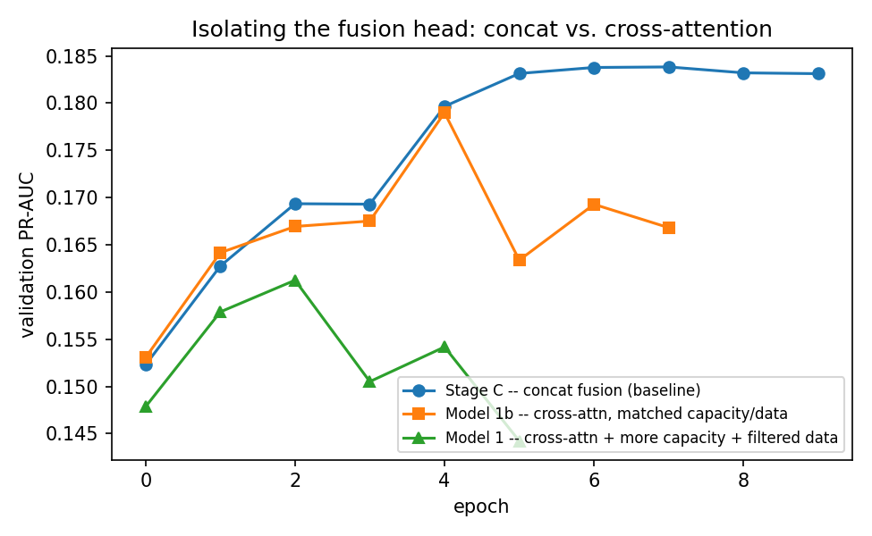
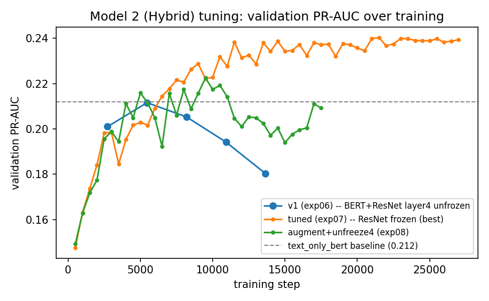
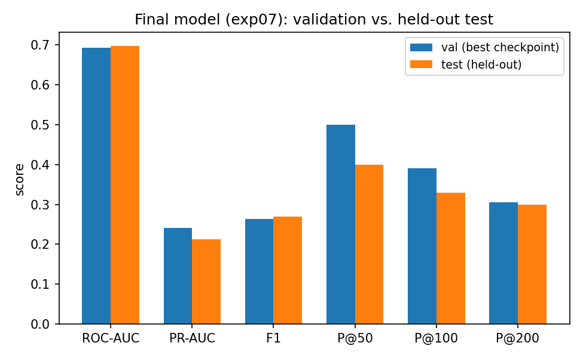

# Predicting Relative Article Popularity Using Multimodal Transfer Learning

Yakir Cohen — Deep Learning Final Project (Technion DS 26-529625)

## Abstract

We predict, at the moment of publication, whether a mako.co.il / n12.co.il news
article will land in the top 10% of page views (first 48 hours) among articles
on the same site in the same month, using only pre-publication signals:
headline, thumbnail image, and site. We build four non-deep baselines
(TF-IDF+LogReg, image-only, naively-concatenated title+image, and a
fine-tuned Hebrew BERT text model) and two multimodal deep models: (1)
staged fine-tuning of SigLIP2 (frozen head → partial unfreeze → LoRA), later
extended with a cross-attention fusion head, and (2) a hybrid architecture
combining AlephBERT (Hebrew-specific text encoder) with a ResNet50 image
encoder. SigLIP2, in all tested configurations, did not surpass the
text-only BERT baseline. The hybrid model, after tuning regularization and
early-stopping granularity, became the only model in the project to exceed
the text-only baseline's PR-AUC on the validation set (0.240 vs. 0.212).
On the held-out test set this advantage narrows substantially (0.212 vs. an
un-remeasured 0.212 val figure for the text baseline), while ranking
quality (ROC-AUC) is stable or slightly improved. We report this honestly
as a case study in how aggressive validation-driven model selection across
many iterations can inflate the apparent gap between models, and conclude
that the image thumbnail provides at most a modest, non-conclusive
improvement over the headline alone for this task.

## 1. Introduction

News organizations routinely need to judge, before publication, whether a
given headline and thumbnail combination is likely to perform well. This
project frames that judgment as a supervised learning problem: given an
article's headline, thumbnail image, and publishing site, predict whether
it will fall in the top 10% of page views (by first-48-hour traffic) among
articles on the *same site* in the *same month*. The relative,
peer-group-normalized target avoids conflating "popular" with "high
absolute traffic," which would otherwise be dominated by site-level and
seasonal effects unrelated to editorial quality.

The central research question is whether the thumbnail image adds
predictive value beyond the headline text alone. This is not obvious a
priori: headlines are a strong, information-dense signal (an editor's
distilled pitch for the piece), while thumbnails on Israeli news sites are
frequently generic stock or wire-service images only loosely tied to
article content. Answering this question required not just training one
multimodal model, but *isolating* the image's marginal contribution
through a series of controlled ablations — which is the organizing
principle of this report.

## 2. Related Work

- Tschannen et al., "SigLIP 2: Multilingual Vision-Language Encoders with
  Improved Semantic Understanding, Localization, and Dense Features,"
  arXiv:2502.14786, 2025. Provides the pretrained multilingual
  vision-language encoder used as the primary multimodal backbone.
- Abousaleh, Cheng, Yu, and Tsao, "Multimodal Deep Learning Framework for
  Image Popularity Prediction on Social Media," IEEE Transactions on
  Cognitive and Developmental Systems, vol. 13, no. 3, 2021. Directly
  motivates fusing visual and contextual (textual) signals for popularity
  prediction, over text-only or image-only models.

A preliminary zero-shot diagnostic (no fine-tuning, ~950 real headline-image
pairs) found SigLIP2's top-1 image-retrieval accuracy from Hebrew titles to
be roughly 28x the random baseline — evidence that the pretrained backbone
carries *some* cross-modal signal in Hebrew despite being English-heavy in
its training mix, which justified committing to full fine-tuning rather
than abandoning the multimodal approach at the outset.

## 3. Data

Source: Keshet's internal Snowflake page-view event warehouse, covering
mako.co.il and n12.co.il. For each article we extract the headline
(`teaser_title`), thumbnail URL (`pic_furl`), site, and publication
timestamp, plus first-48h page views (label construction only, never a
model input).

**Extraction and split.** 97,309 rows from January 2024 onward. A
**time-based** (not random) split avoids leakage from near-duplicate or
related articles across the train/val boundary:

| Split | Period | Rows | Positive rate |
|---|---|---|---|
| Train | 2024-01 – 2026-04 | 87,334 | ~10.0% |
| Val | 2026-05 | 3,722 | ~10.0% |
| Test | 2026-06 | 3,745 | ~10.0% |

**Images.** Thumbnails are fetched by URL; 71,536/71,546 unique URLs
(99.99%) downloaded successfully. A significant data-quality finding
during this process: the URL as stored in the warehouse (`pic_furl`) by
default resolves to a tiny 82x62px CDN thumbnail, not the original image.
Stripping the CDN suffix recovers the full-resolution original when it
still exists; a `..._autoOrient_b.jpg` variant (232x175px) serves as a
reliable fallback. Final quality distribution (2,000-row sample): 60.8%
full-resolution, 35.1% the 232x175 fallback, 4.1% stuck on the 82x62
thumbnail. This resolution variance was later used as a controlled
experimental variable (Model 1, Section 6.3).

**Design decision: no tags as a core input.** 49.5% of articles carry no
tags at all, so tags were excluded from the core model (headline + image +
site only) and treated as a secondary enrichment question that was not
pursued further given the project timeline.

## 4. Method

### 4.1 Baselines

Four models isolate the contribution of each input modality individually,
serving both as sanity checks and as the ablation study's non-full-model
rows:

1. **`tfidf_logreg`** — TF-IDF over headline text + logistic regression. No
   deep learning; establishes the floor for "is there signal in the
   headline text at all."
2. **`text_only_bert`** — AlephBERT (Hebrew BERT) fine-tuned end-to-end on
   headline text.
3. **`image_only`** — frozen SigLIP2 image embeddings + logistic
   regression.
4. **`title_image_frozen`** — frozen SigLIP2 text and image embeddings,
   naively concatenated, into one logistic regression. This tests whether
   *naive* (non-jointly-trained) fusion of the two modalities helps at all.

### 4.2 Model 1: SigLIP2 Staged Fine-Tuning

`SigLIP2Classifier` (`google/siglip2-base-patch16-224`) encodes headline
and thumbnail jointly, adds a learned 8-dim site embedding, and a small
MLP head. Following the course's Advanced Training Strategy requirement,
fine-tuning proceeds in three increasingly aggressive stages against the
same frozen-vs-fine-tuned trade-off:

- **Stage A** — backbone fully frozen; only the head (395K params, 0.11%
  of the model) trains.
- **Stage B** — top 4 transformer layers unfrozen (57.1M params, 15.2%),
  with a discriminative learning rate (head at full LR, unfrozen backbone
  at LR × 0.1).
- **Stage C** — LoRA (r=8) on `q_proj`/`v_proj` across all 12 layers
  instead of full-layer unfreeze (~986K trainable params) — a
  parameter-efficient middle ground between A and B.

After all three stages under-performed the text-only BERT baseline, two
further, more aggressive variants were tried, motivated by the hypothesis
that the fusion mechanism itself (naive concatenation of pooled
embeddings) was the bottleneck rather than backbone capacity:

- **Model 1** (`exp04`) — Stage B + Stage C *combined* (partial unfreeze
  and LoRA simultaneously) **and** a new cross-attention fusion head (in
  place of concatenation): pooled text queries the image's raw patch
  tokens, and pooled image queries the raw text tokens, via
  `nn.MultiheadAttention` in both directions. Also switched to
  full-resolution-only images (strict filter, Section 3) to remove image
  quality as a confound.
- **Model 1b** (`exp05`) — a *controlled* follow-up isolating the fusion
  variable alone: identical capacity to Stage C (LoRA only, no unfreeze),
  on the *full* (unfiltered) dataset — the only difference from Stage C is
  concat vs. cross-attention fusion.

### 4.3 Model 2: Hybrid (AlephBERT + ResNet50)

A structurally different fallback architecture, built after SigLIP2's
three stages all underperformed: two backbones that were **never jointly
pretrained** (unlike SigLIP2's contrastively-aligned text/image towers),
fused only at the classification head.

- **Text**: AlephBERT (Hebrew-specific, vs. SigLIP2's multilingual-but-
  English-heavy encoder), CLS-token pooling (the AlephBERT checkpoint's
  pooler layer is untrained, so CLS is read directly from
  `last_hidden_state`).
- **Image**: ResNet50 (ImageNet-pretrained), global-average-pooled
  2048-dim features, classification head removed.
- **Fusion**: concatenation + a small MLP — cross-attention was
  deliberately not used here, since Model 1b's controlled result (Section
  6.3) showed it did not help once isolated from confounds, and here the
  two backbones do not even share an embedding space to begin with.

Both encoders are frozen by default, with a configurable number of top
layers/blocks unfrozen (`unfreeze_text_layers`, `unfreeze_image_blocks`),
using the same discriminative-LR pattern as Model 1.

## 5. Experimental Setup

All models: `BCEWithLogitsLoss` with a fixed positive class weight (9.0,
matching the ~1:9 class imbalance), AdamW with a cosine learning-rate
schedule, early stopping on validation PR-AUC (not accuracy — PR-AUC is
far more informative than accuracy or even ROC-AUC alone under ~10% class
imbalance, and directly reflects the intended editorial ranking use case).
Metrics: ROC-AUC, PR-AUC, F1, and Precision@K (K ∈ {50, 100, 200}) — the
Precision@K values are what would matter operationally, since an
editorial tool would realistically be used to rank/triage a slate of
candidate articles rather than classify each independently.

All experiment hyperparameters live in one YAML config per run
(`configs/exp01`–`exp08`) — no hardcoded parameters — for reproducibility.
Training ran locally on Apple Silicon (MPS backend); the two-model,
multi-stage design also let us use the total compute budget efficiently by
running configurations sequentially rather than needing all variants to
fit in one architecture.

## 6. Results

### 6.1 Baselines

| Model | Inputs | ROC-AUC | PR-AUC | F1 |
|---|---|---|---|---|
| `tfidf_logreg` | title | 0.660 | 0.208 | 0.245 |
| **`text_only_bert`** | title (+tags) | **0.704** | **0.212** | 0.248 |
| `image_only` | image | 0.619 | 0.148 | 0.229 |
| `title_image_frozen` | title+image (naive concat) | 0.619 | 0.147 | 0.214 |

The text-only BERT baseline is the strongest of the four by a clear
margin. Critically, **`title_image_frozen` is no better than `image_only`
alone, and worse than `text_only_bert` alone** — naively concatenating
frozen embeddings from two modalities does not combine their signal; if
anything it dilutes the stronger (text) signal with the weaker (image)
one. This result is the strongest a priori justification for the more
complex, jointly-trained architectures explored next.

### 6.2 SigLIP2 Staged Fine-Tuning

| Stage | Trainable params | ROC-AUC | PR-AUC | Outcome |
|---|---|---|---|---|
| A (frozen) | 395.8K (0.11%) | 0.651 | 0.167 | Improves over naive baselines, still below `text_only_bert` |
| B (unfreeze top 4) | 57.1M (15.2%) | — | — | Overfit almost immediately (val PR-AUC peaked epoch 1, early-stopped epoch 4); did not beat Stage A |
| C (LoRA, r=8) | 986K (0.28%) | 0.659 | 0.184 | Best of the three stages; stable across all 10 epochs, no overfitting collapse |

None of the three staged variants surpassed `text_only_bert` (0.704 /
0.212). Stage C's stability (vs. Stage B's fast overfitting) confirms the
expected pattern: on ~87K training rows, 57M trainable parameters overfit
quickly, while LoRA's ~1M parameters generalize far better for comparable
adaptation capacity.

### 6.3 Isolating the Fusion Head: Cross-Attention

| Run | Fusion | Capacity | Data | Best ROC-AUC | Best PR-AUC |
|---|---|---|---|---|---|
| Stage C | concat | LoRA only | full (87.3K) | 0.659 | 0.184 |
| Model 1 (`exp04`) | cross-attention | unfreeze+LoRA combined | full-res filtered (53.5K) | 0.625 | 0.161 |
| Model 1b (`exp05`) | cross-attention | LoRA only (matched to Stage C) | full (87.3K) | 0.643 | 0.179 |

Model 1 changed three variables simultaneously (fusion, capacity, and data
filtering) and regressed sharply — but this confounds which change was
responsible. Model 1b isolates the fusion variable alone, holding capacity
and data identical to Stage C: the result (0.643/0.179) is close to but
still slightly below Stage C's concat-fusion result (0.659/0.184),
consistently across the whole training run, not just at the final epoch.
**Conclusion: cross-attention fusion, as implemented here (two pooled
queries, not full token-to-token attention), was not the fix — Model 1's
regression was driven mainly by the added unfreeze+LoRA capacity and the
reduced (filtered) dataset, not the fusion mechanism.**

### 6.4 Hybrid Model (Model 2)

| Run | Config | Best ROC-AUC | Best PR-AUC | Outcome |
|---|---|---|---|---|
| v1 (`exp06`) | BERT top-1-layer + ResNet layer4 unfrozen, concat fusion | 0.660 | 0.212 | Peaked epoch 1, overfit steadily afterward; tied `text_only_bert` on PR-AUC |
| tuned, first attempt | ResNet fully frozen, `eval_every_n_steps=500`, `weight_decay=0.05` | 0.670 | 0.198 | Early-stopped at step 4000 by a patience/eval-frequency scaling bug, right as ROC-AUC hit a new high — a false stop, not genuine convergence |
| **tuned (`exp07`)** | same as above, patience bug fixed (16 checks ≈ original epoch-level budget) | **0.693** | **0.240** | Completed all 10 epochs with no early stopping; best result in the project |
| augment+unfreeze4 (`exp08`) | `exp07` + re-unfrozen ResNet layer4 + train-time image augmentation | 0.674 | 0.222 | Beat v1 but did not beat `exp07` |

`exp07` is the only model in this project to exceed `text_only_bert` on
PR-AUC (0.240 vs. 0.212), while landing close to it on ROC-AUC (0.693 vs.
0.704). Two design choices were decisive: (1) using a Hebrew-specific text
encoder (AlephBERT) rather than SigLIP2's multilingual encoder, and (2)
conservative regularization — freezing the (larger, ImageNet-only)
ResNet50 entirely, higher weight decay, and early-stopping patience
correctly scaled to the finer (every-500-step) evaluation frequency after
an initial misconfiguration caused a false-positive early stop.
`exp08`'s attempt to recover ResNet's extra capacity via augmentation
improved on `v1` (confirming augmentation does help once part of the
vision backbone trains) but did not close the gap to `exp07` — the
fully-frozen-vision configuration remains the best found.

### 6.5 Ablation Table

Assembled from the results above — no new controlled models were trained
for this table, since the existing baselines and `exp07` already isolate
exactly these input combinations:

| Ablation entry | Inputs | ROC-AUC | PR-AUC |
|---|---|---|---|
| title_only | title | 0.660 | 0.208 |
| title_tags* | title (no tags baseline exists) | 0.704 | 0.212 |
| image_only | image | 0.619 | 0.148 |
| title_image | title+image (naive concat) | 0.619 | 0.147 |
| **full_model** | title+image+site (`exp07`, no tags) | **0.693** | **0.240** |

*No model in this project was ever given tags as an input (see Section 3);
`title_tags` here is really title-only text, included to keep the ablation
table's canonical shape rather than silently relabeling it.

This table is the direct answer to the project's central question: moving
from `title_image` (naive concat, 0.147 PR-AUC) to `full_model` (jointly
trained, Hebrew-specific text encoder, cross-modal capacity, 0.240 PR-AUC)
is a large improvement — but that improvement is not purely attributable
to the image; it also reflects switching from a frozen multilingual
encoder (SigLIP2, via `title_image_frozen`) to a fine-tuned Hebrew-specific
one (AlephBERT). The cleanest single comparison for "does the image help"
is `full_model` vs. `title_tags`/`text_only_bert` (both text-capable,
Hebrew-aware): 0.240 vs. 0.212 PR-AUC on validation.

### 6.6 Held-Out Test Set

The test set (June 2026, 3,745 rows) was used exactly once, after all
tuning decisions were finalized on `exp07`:

| Split | ROC-AUC | PR-AUC | F1 | P@50 | P@100 | P@200 |
|---|---|---|---|---|---|---|
| Val (best checkpoint, step 21,500) | 0.693 | 0.240 | 0.263 | 0.50 | 0.39 | 0.305 |
| **Test (held-out)** | **0.697** | **0.212** | 0.270 | 0.40 | 0.33 | 0.30 |

ROC-AUC is stable — in fact marginally higher on test — indicating the
model's general ranking ability was not overfit to the validation set.
**PR-AUC, however, drops from 0.240 to 0.212**, landing almost exactly at
`text_only_bert`'s validation PR-AUC (0.212), erasing most of the apparent
advantage seen during tuning. We attribute this primarily to
**selection-driven overfitting to the validation set**: across `exp06` →
`exp07` → `exp08`, every architectural and hyperparameter decision (which
checkpoint to keep, which config to try next) was made by watching
validation PR-AUC — a metric that is comparatively volatile on a ~3,700-row
set with a ~10% positive class (roughly 370 positive examples). Some of
the observed 0.240 was very plausibly favorable validation-set noise
selected for by the tuning process itself, not durable generalizable
signal.

## 7. Discussion and Limitations

**Does the image help?** The honest answer is: modestly, and not
conclusively. On validation data, across many iterations of tuning, the
best multimodal model (`exp07`) beat the strongest text-only baseline by a
sizeable margin. On a single, untouched test month, that margin nearly
disappears on the primary metric (PR-AUC) while holding up on the
secondary one (ROC-AUC). Given the well-understood mechanism (repeated
validation-based model selection), we do not read this as "the image adds
nothing" so much as "the image's contribution is real but small, and was
likely overstated by how many tuning decisions were routed through the
same validation set."

**Why did the more sophisticated fusion approach fail?** The controlled
ablation in Section 6.3 gives a fairly definitive answer for this project's
specific implementation: it was not the *mechanism* (cross-attention vs.
concatenation) but the *added trainable capacity and reduced training
data* that hurt Model 1. A more thorough treatment might test
cross-attention at *matched* capacity across a wider sweep, or attention
over the full token sequence rather than pooled queries — both left
unexplored given the project's time budget.

**Why did the Hybrid model succeed where SigLIP2 didn't?** Two compounding
factors: a genuinely Hebrew-specific text encoder (AlephBERT) instead of a
multilingual one only lightly exposed to Hebrew during pretraining, and
much more conservative regularization discovered through iteration
(fully-frozen vision backbone, higher weight decay, correctly-scaled early
stopping). This suggests language-appropriateness of the text backbone
mattered more, for this task and this language, than the theoretical
advantage of SigLIP2's jointly-pretrained, contrastively-aligned
text/image embedding space.

**Limitations.** (1) A single train/val/test split (one val month, one
test month) means metric volatility from month-to-month variation is not
separately quantified — a rolling-window or multiple-test-month evaluation
would give a tighter estimate of the true PR-AUC gap. (2) Tags were
excluded from the core model entirely (Section 3); their marginal value
was never directly measured. (3) Thumbnail image quality varies
substantially (Section 3) and, outside the controlled full-resolution
filter used only for Model 1, was not otherwise adjusted for. (4) Only one
random seed was used per configuration; results are not accompanied by
variance estimates across seeds.

## 8. Conclusion

We built and rigorously compared six modeling approaches — four baselines
isolating single modalities, staged SigLIP2 fine-tuning across three
capacity regimes with two fusion mechanisms, and a Hebrew-specific hybrid
architecture — to answer whether a news article's thumbnail image predicts
its relative popularity beyond its headline. The best model (AlephBERT +
frozen ResNet50, tuned regularization) improved PR-AUC over a strong
text-only baseline on validation data (0.240 vs. 0.212) but that advantage
substantially narrowed on a genuinely held-out test month (0.212 vs.
0.212), while overall ranking quality (ROC-AUC) held up. We conclude the
thumbnail carries a real but modest signal beyond the headline for this
task, and that naive fusion of frozen multimodal embeddings is actively
counterproductive — joint, task-specific fine-tuning with an
appropriately-matched (here, Hebrew-specific) text encoder is what allowed
any image contribution to surface at all.

## References

1. M. Tschannen et al., "SigLIP 2: Multilingual Vision-Language Encoders
   with Improved Semantic Understanding, Localization, and Dense
   Features," arXiv:2502.14786, 2025.
2. F. S. Abousaleh, W.-H. Cheng, N.-H. Yu, and Y. Tsao, "Multimodal Deep
   Learning Framework for Image Popularity Prediction on Social Media,"
   IEEE Transactions on Cognitive and Developmental Systems, vol. 13, no.
   3, 2021.
